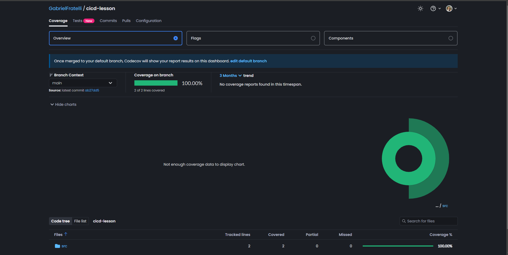

## Sobre ✔️

Exemplo de básico sobre Continuous Integration (CI) — integração contínua — e a Continuous Delivery (CD) — entrega contínua em JavaScript.
 
 
<a href="https://github.com/resources/articles/devops/ci-cd" target="_blank">Clique aqui para acessar uma das Documentações sobre CI/CD</a>

---

## Tecnologias Utilizadas 📎

Esse projeto foi desenvolvido com as seguintes tecnologias:

- [ReactJs](https://react.dev/learn/installation)
- [Codecov](https://about.codecov.io/)

---

## Pré-requisitos 📝

Para rodar este projeto é necessário ter instalado na sua máquina as seguintes tecnologias:

- É necessário possuir o [Node.js](https://nodejs.org/en/) instalado na máquina.
- Também, é preciso ter um gerenciador de pacotes seja [Yarn](https://yarnpkg.com/) ou [Npm](https://www.npmjs.com/).

## Para rodar o projeto 📌

1. Escolher o emulador da sua preferência.
2. Instale as dependências: `npm install` ou `yarn`
3. Rodar teste `yarn test`
4. Startar a aplicação: `npm run start` ou `yarn start`

## Resultado 📷

    

